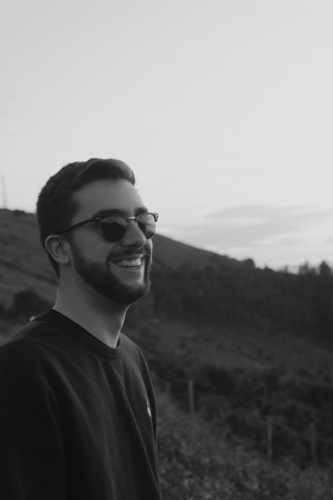

<!doctype html>
<html lang="es">
  <head>
    <meta charset="utf-8" />
    <meta name="author" content="Unai Pellejero" />
    <meta name="description" content="Mi página de prueba" />
    <title>Mi página de prueba</title>
    <link href="styles/style.css" rel="stylesheet" type="text/css" />
    <link href="https://fonts.googleapis.com/css2?family=Open+Sans:ital,wght@0,300..800;1,300..800&display=swap" rel="stylesheet">
  </head>
  <body>
    <h1>UNVISUAL MEDIA</h1>
    
    
Índice
  
    
En esta web encontraras

    <ul>
        <li>Proyectos</li>
        <li>Sobre mí</li>
        <li>Contacto</li>
    </ul>
    <a class="youtube" href="https://www.youtube.com/@Unvisualmedia" title="Canal de youtube">YouTube UnvisualMedia</a>
    
2025 all rights reserved. Created by Unai Pellejero

    <button>Cambiar de usuario</button>
    
  </body>
</html>
